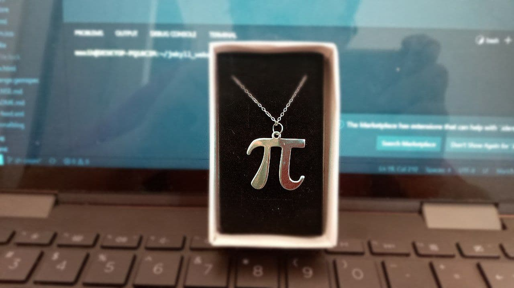

Wow, its been 2 months since my last post? Didn't figure it was _that_ long. Sorry though.

First let me breeze through that sandwich (which I'm calling _the greatest sandwich on earth_):

All you need is
- some good bread
- an egg
- fresh lettuce (iceberg preferred)
- hot ketchup
- a slice of cheese (yellow American is great, I'd love to try Munster as well)

Toast the bread, then fry the egg however you like (putting cheese on it either just after it has left the pan or in the last 10 seconds of cooking) and shred your lettuce.

To assemble: bread, egg, ketchup, lettuce, bread.

Enjoy with: Orange juice or lemonade (beer if you feel like drinking).

This sandwich is so great, I could have it every single day if I could! It truly is the _greatest sandwich on earth_ and it just brightens my day everytime that I make it. With the recipe done, lets get to the rest of the post.

------------------

I was feeling strange for a few days --- I say "was" because I think its over now --- and it was because I was ignored by my friends a few times. It was kinda hard, getting ghosted by people who just weeks ago were dying to get to know you more. But hey, thats life right?

Last night I was talking with a friend of mine and I was talking about the difficult situation that I am in right now; I'm at a point in my life where I _need_ to experience deep and meaningful relationships, but, I also cannot afford to due to my work and the impending immigration situation I have to work through. It sure feels bad getting double teamed by feelings of "I need to have someone" and "I can't afford to let anyone come close". 

Anyways, the new Drake album is out and the intro is really awesome

<iframe style="display:block; margin:auto" src="https://open.spotify.com/embed/track/2HSmyk2qMN8WQjuGhaQgCk" width="100%" height="80" frameBorder="0" allowtransparency="true" allow="encrypted-media"></iframe>

I'm also working more on making connections with new people, I'm putting aside my pathological shyness and just getting in there. Sure, I might meet a lot of people that I would later regret, but thats okay as long as I get to know good people along the way.

Speaking of good people, a friend of mine bought me a silver necklace in the shape of the greek letter $\pi$ for my birthday which I absolutely loved. She is one of those friends that I really appreciate and hope that I can keep for a long time.

Oh and tomorrow is my birthday (technically I was born september 4th, I don't know how the dates work). 

Photo taken [from Flicker](https://www.flickr.com/photos/memoriesbymike/20682706330/).